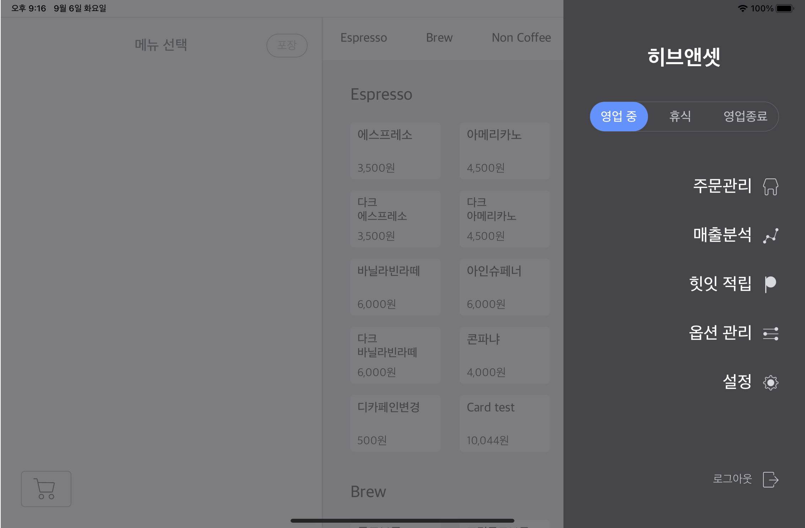
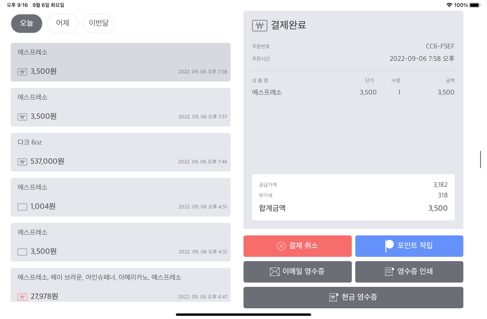
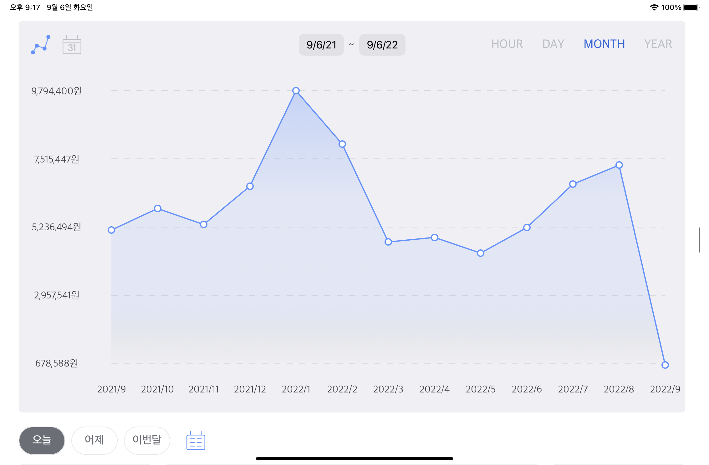
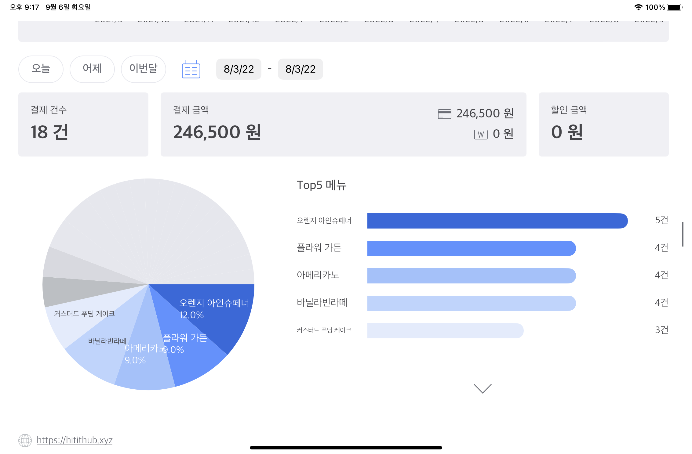
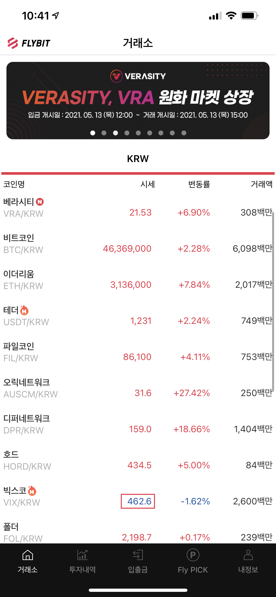
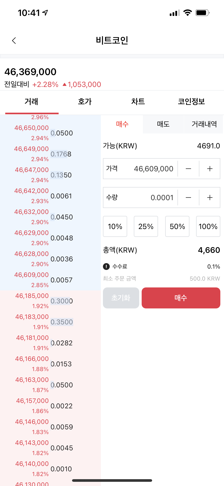
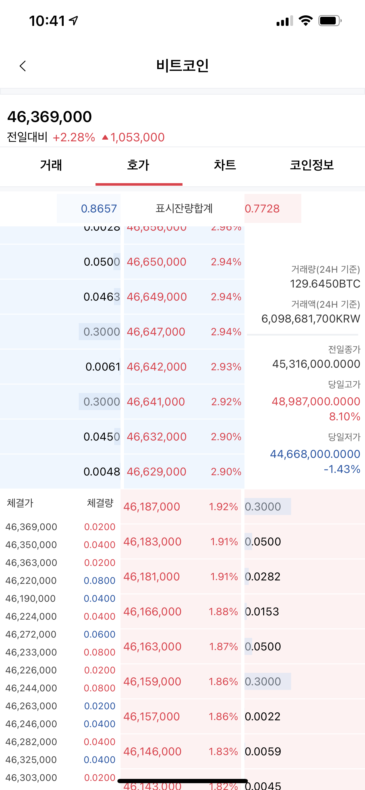
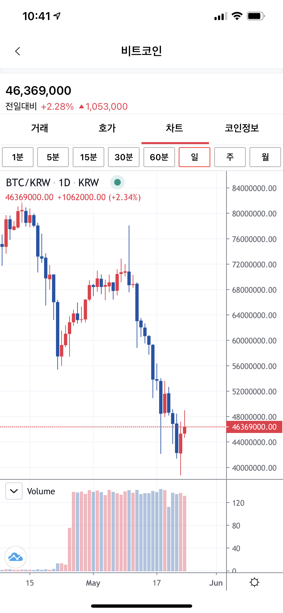

# 이은택 (Euntaek Lee)

## 🚀 소개

iOS와 서버 개발을 전문으로 하는 개발자입니다. 모바일 애플리케이션과 서버 시스템 개발에 대한 15년 이상의 경험을 갖추고 있으며, 성능 최적화와 클린 아키텍처에 대한 깊은 이해를 바탕으로 견고한 소프트웨어를 구축합니다. SwiftUI, Concurrency, Kotlin, Spring Boot 등 최신 기술을 활용한 개발을 지향합니다.

## 💼 경력

### [힛잇 주식회사](https://hitit.xyz/)
**연구원** | 2021/09 ~ 현재
- 힛잇 허브 iPad 앱 개발 (SwiftUI, Combine, Concurrency, Clean Architecture)
- 힛잇 허브 Flutter 앱 개발 (Dart, Cubit, Clean Architecture)
- 힛잇 허브 미들 서버 개발 (Kotlin, Spring Boot, JPA, QueryDSL)

### [한국디지털거래소](https://flybit.com)
**차장** | 2021/03 ~ 2021/08
- Flybit iOS 앱 신규 개발 및 유지보수 (Swift, RxSwift, WebSocket)

### [빅솔론](https://bixolon.com/kr/)
**과장** | 2016/02 ~ 2021/02
- 공통 통신 라이브러리 및 데이터 생성 모듈 개발
- 다수의 iOS 앱 개발 및 SDK 리팩토링
- 프린터 제어 관련 기술 개발

### [GNSD]()
**주임** | 2014/12 ~ 2016/02
- 포드 AVN 개발 (Bluetooth, Setting, DVD 모듈)

### [큐빅테크]()
**주임** | 2013/12 ~ 2014/12
- 공정 검사 자동화 프로그램 개발 (OpenGL 기반 그래픽스 계산)

### [m3mobile](http://www.m3mobile.co.kr/)
**연구원** | 2010/03 ~ 2012/08
- WinCE Scanner 통합 SDK 개발
- 전화 모듈 디바이스 드라이버 개발

## 🛠️ 기술 스택

### 모바일 개발

### 백엔드 개발

### 데이터베이스

### 인프라 & 도구

### 아키텍처 & 방법론

## 📱 주요 프로젝트

### 힛잇 허브 Flutter 앱

- **개발 기간**: 2023.12.01 ~ 2024.07.01
- **설명**: 기존 iOS 전용 어플리케이션의 Flutter 앱 개발
- **기술**: Dart, Cubit, Clean Architecture, TCP Socket, injectable, retrofit, rxdart, dio, Unit test
- **링크**: [Google Play](https://play.google.com/store/apps/details?id=xyz.hitithub.hub)

### 힛잇 허브 미들 서버

- **개발 기간**: 2023.01.01 ~ 
- **설명**: 힛잇 허브 일부 서비스 지원을 위한 미들 서버 개발
- **기술**: Kotlin, Spring Boot, JPA, QueryDSL, MySQL, AWS(EC2, RDS, S3)

### 힛잇 허브 iPad 앱

- **개발 기간**: 2022.01.01 ~ 2022.09.20
- **설명**: 아이패드 전용 POS 어플리케이션 개발
- **기술**: SwiftUI, Combine, Concurrency, Clean Architecture, TCP Socket, Unit test
- **링크**: [App Store](https://apps.apple.com/kr/app/hitithub/id1485395039?l=en)
- **데모**: [YouTube 1](https://youtu.be/erWdBo8ZUoA), [YouTube 2](https://youtu.be/3JvoyJ0Iksw)

  
  
  
  

### Flybit iOS 앱

- **개발 기간**: 2021.03.21 ~ 2021.05.25
- **설명**: 가상화폐 거래소 앱인 Flybit iOS 앱 신규개발 및 유지보수
- **기술**: Swift, RxSwift, git, Realm, firebase, WebSocket, non-storyboard, RxAlamofire
- **링크**: [App Store](https://apps.apple.com/us/app/flybit/id1570368673)

  
  
  
  

### 통신/데이터 공통 라이브러리 개발

- **소속**: 빅솔론
- **설명**: 다수의 SDK/앱에서 공통으로 사용하는 프린터 통신 및 커맨드 생성 모듈 개발
- **기술**: Objective-C, iOS, Unit test, git
- **특징**: Bluetooth, Wi-Fi, Ethernet, BLE 등 다양한 통신 방식 지원

### mPrint 앱

- **소속**: 빅솔론
- **설명**: Action Extension을 제공하여 3rd Party 앱에서 프린터 인쇄 기능 지원
- **기술**: Swift, Realm, CoreData, Snapkit, RxSwift, RxCocoa, Action Extension, non-storyboard, Unit test, git, carthage
- **링크**: [App Store](https://apps.apple.com/app/id1439539765)

  
  
  
  

### UPOS SDK / Label SDK 리팩토링

- **소속**: 빅솔론
- **설명**: 프린터 제어 SDK 리팩토링 및 샘플 앱 개발
- **기술**: Objective-C, Swift, iOS, Unit test, git
- **주요 개선사항**: 
  - MRC → ARC 전환
  - 내부 코드 재구현
  - 다중 프린터 동시 연결 기능 지원
  - Objective-C 및 Swift 샘플 앱 개발
- **링크**: 
  - [UPOS SDK](https://www.bixolon.com/_lib/download_single.php?FILE_INFO=sdk|sdk_file|sdk_idx|30|sdk)
  - [Label SDK](https://www.bixolon.com/_lib/download_single.php?FILE_INFO=sdk|sdk_file|sdk_idx|29|sdk)

## 🔍 기타 프로젝트

### 포드 AVN 개발 (GNSD)
- **개발 기간**: 2015.02.01 ~ 2015.12.31
- **설명**: Linux 기반의 AVN(Audio Video Navigation) 개발
- **담당**: Bluetooth, Setting, DVD 모듈 개발 및 디바이스 드라이버 개발
- **기술**: Linux, QT

### 공정 검사 자동화 프로그램 (큐빅테크)
- **개발 기간**: 2014.01.01 ~ 2014.10.31
- **설명**: 자동차 공장 공정 검수 프로그램 개발
- **담당**: OpenGL 기반의 3차원 그래픽스 계산 모듈 개발
- **기술**: Windows, OpenGL

### UNI SDK / RIL Driver (M3Mobile)
- **설명**: WinCE 스캐너 통합 SDK 및 전화 모듈 디바이스 드라이버 개발
- **기술**: C, C++, C#, MFC
- **특징**: 모듈별로 나뉘어진 Scanner SDK, System SDK를 하나로 통합

---

## 📚 전문 역량

- **아키텍처**: Clean Architecture, MVVM, SOLID 원칙 준수, 디자인 패턴 활용
- **모바일 개발**: iOS 네이티브 앱, 크로스 플랫폼 앱(Flutter)
- **백엔드 개발**: REST API, 데이터베이스 설계, 서버 인프라 구축
- **성능 최적화**: 메모리 관리, 렌더링 최적화, 데이터 처리 효율화
- **자동화 테스트**: 단위 테스트, UI 테스트, 코드 품질 관리

## 📫 연락처

- **이메일**: catmasterdeveloper@gmail.com
- **GitHub**: [https://github.com/mozzy-swift]
- **LinkedIn**: [https://www.linkedin.com/in/euntaek-lee-30a682360](https://www.linkedin.com/in/euntaek-lee-30a682360)
